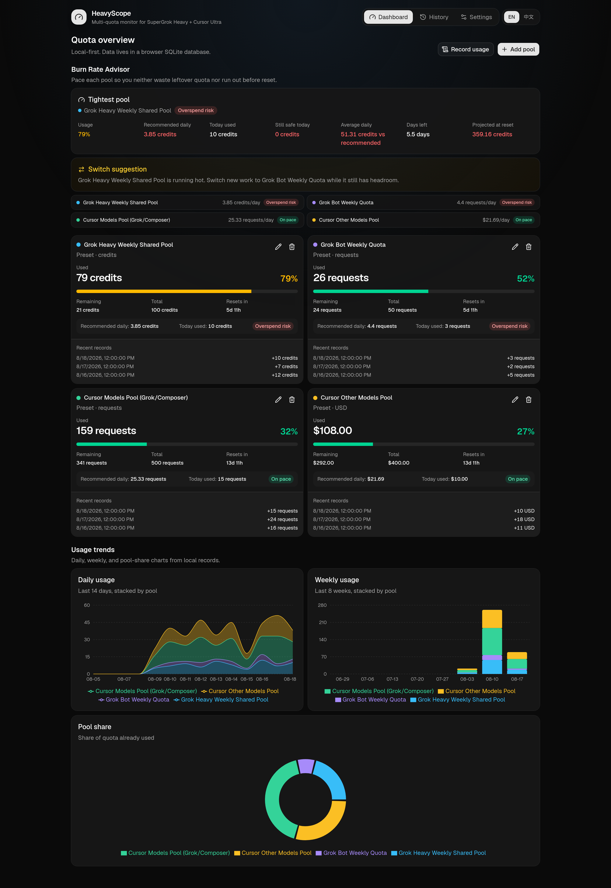
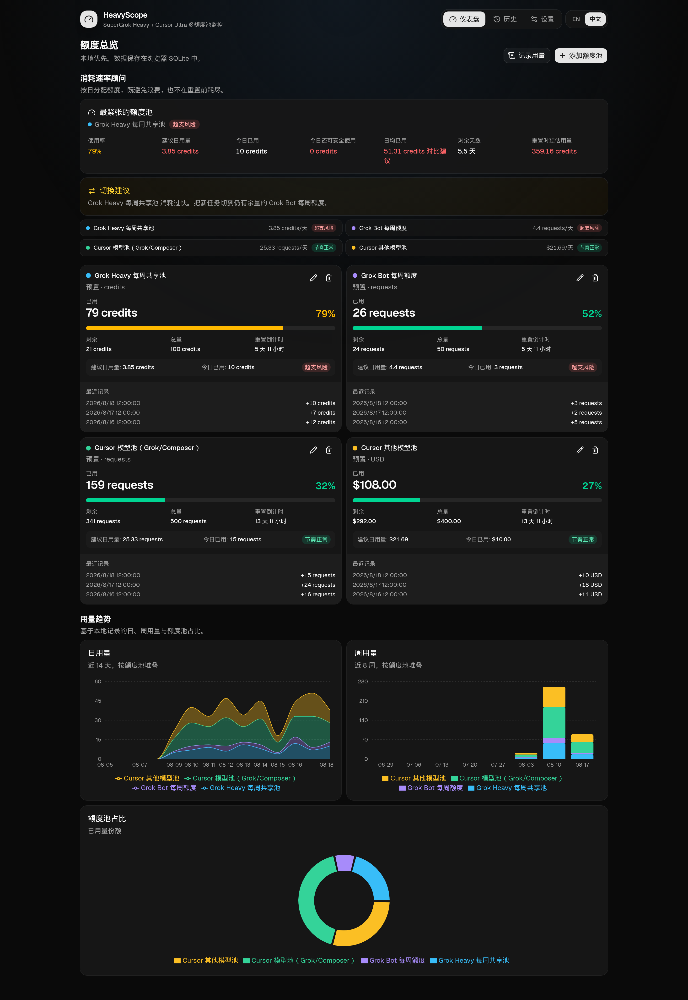
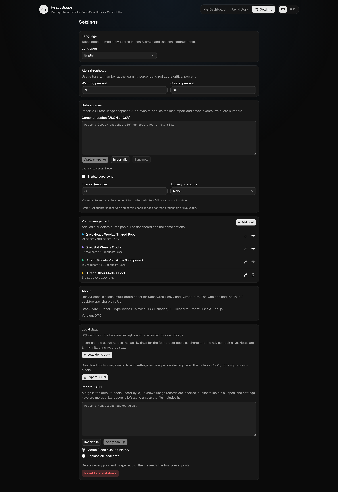
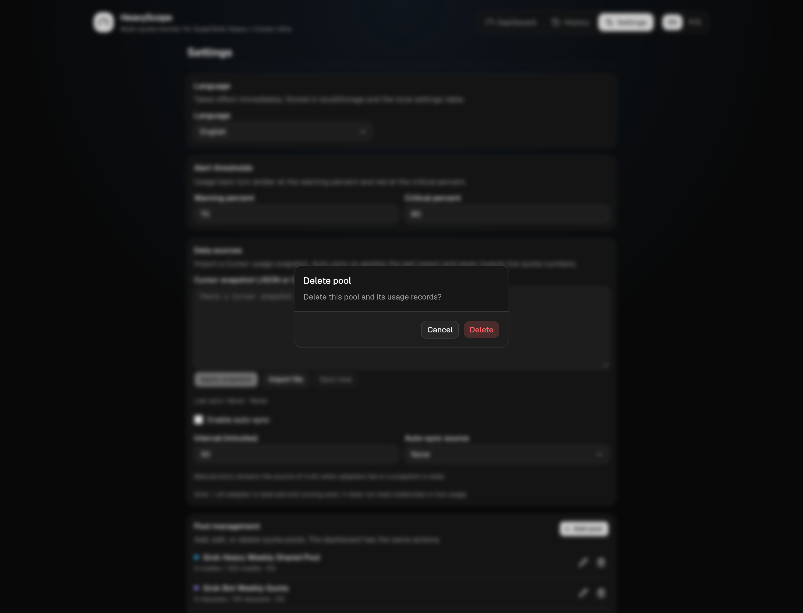

# HeavyScope

Local-first multi-quota monitoring panel for SuperGrok Heavy and Cursor Ultra.

HeavyScope helps you see how fast you are burning weekly or monthly quotas, when a pool will reset, and whether you should switch work to a pool with more headroom. The same React UI runs as a web app and inside a Tauri 2 desktop shell. Quota data stays on your machine. There is no HeavyScope cloud account.

Current product version is **0.25.0**.

## Features

- **Dashboard + burn rate advisor** — four preset pools plus custom services, progress bars, remaining quota, reset countdown, and usage-tone colors. The advisor shows recommended daily pace, today used, waste / overspend risk, and cross-pool switch suggestions.
- **Widget grid** — advisor, heatmap, trend, unit-safe pies, and every pool are independent cards. From `md` up the dashboard is a stable 4-column grid (`sm` = 1/4, `md` = 1/2, `lg` = full, optional `xl` = full + tall). Same-row tiles share height. Edit chrome overlays the card so neighbors never collide. **Refresh now** is the primary toolbar action; Edit is outline; Record usage and Add pool sit in More. Edit / Done reveals drag-to-reorder (cards slide aside live to show the insertion slot), size chips, and hide/restore. Normal mode stays clean (no grips or checkboxes). Layout is saved as `dashboard_layout` in the local settings table; old `chart_show_*` / `chart_module_order` prefs migrate automatically.
- **Charts / history** — Daily Activity heatmap uses GitHub contribution greens. Week columns follow available width (not a hardcoded 10-week / 10-month strip). Cells stay 1:1 squares; leftover card space is legend / stats. Month labels sit on the first week of that month and stay readable. Intensity uses that day's usage amount when every record shares one unit; mixed $ and % stay on record count. The trend chart plots live deltas (`+N` per bucket) with hover amounts at 2dp for USD and at most 2dp for percent. Two pies: used % (safe across pools) and remaining share among comparable absolute units (`sm` hides labels); dashboard pies have no outer white stroke. Pool cards show the latest two Recent rows in a fixed-height box; older rows live on History. History defaults to live sync + manual and hides demo-seeded sample rows.
- **Settings** — Data sources first (paste a Cursor or Grok token), then language (EN / 中文), theme (dark / light / system; default dark), alert thresholds (warn / crit), pool management (add / edit / delete), and JSON backup export / copy / import.
- **Live Cursor + Grok sync** — connect your own accounts in web Settings → Data sources **or** in the menu-bar `/tray` Settings pane. Saving a Cursor session token or Grok session/bearer puts that provider on the timer immediately (1 / 5 / 15 / 30 / 60 min, default 5). Dashboard, Settings, and `/tray` show last synced + next tick per provider. A failed Grok tick is shown and does not skip later ticks. Snapshot import stays as a Cursor fallback when no session token is stored.
- **Cursor snapshot import** — paste a Cursor usage snapshot (JSON or CSV) in Settings → Data sources. Optional auto-sync re-applies the last import when live Cursor is not connected.
- **JSON backup export / copy / import** — Settings → Local data downloads `heavyscope-backup.json`, copies the same payload to the clipboard, or accepts a file / paste (table dump, not a wasm / binary file). Merge is the default; replace-all is optional.
- **Tauri 2 tray** — system tray / macOS menu-bar shell around the same web UI and sql.js database. On macOS the shell is an **Accessory** (no Dock icon); the popup is **~380×780** under the status item. `/tray` is the daily loop: in-popover Settings (Cursor + Grok tokens, interval, Refresh now), a one-step **Go to Settings** CTA on unsynced pools, one advisor sentence, expandable pool rows (used/total, remaining, reset, 1–2 increments; one open at a time), last-sync lines, and an optional square heatmap whose week count comes from width (`fitTrayHeatmap`, 8–10px, never a 10-month strip). Browser `/tray` can finish that loop without a Mac. Layout Edit / Done stays secondary. Linux/Windows keep a 980×720 tray window. Close hides to tray. Use Quit to exit. **Verify the menu-bar accessory on a real Mac** — see [docs/MACOS.md](docs/MACOS.md). UNVERIFIED on device.
- **In-app confirm dialogs** — delete pool, reset local database, import, and import replace-all use in-app AlertDialogs with zh-CN / en titles and actions. Native `window.confirm` is not used.
- **Cycle rollover** — when a pool `reset_at` is past, quota used resets to 0, the next weekly/monthly date is set, and a Cycle reset usage note is stored. History is not deleted.

Manual entry remains the source of truth when a connector fails. Tokens you paste stay in the local settings table on this device. JSON backup export redacts them. Unofficial dashboard endpoints may change.

## Screenshots

Dashboard with pool cards, burn-rate advisor, and charts:



Chinese dashboard with the four preset pools:



Settings — pool list and JSON backup export / copy / import:



In-app confirm dialog when deleting a pool:



## Stack

- Vite + React + TypeScript
- Tailwind CSS v4 + shadcn/ui + Recharts
- react-i18next (zh-CN, en)
- sql.js SQLite (web and Tauri webview)
- Tauri 2 tray / macOS Accessory shell in `src-tauri` (see [docs/MACOS.md](docs/MACOS.md))
- Vitest for unit tests
- GitHub Actions CI (Node 22, package manager from packageManager)

## How to run

Requires Node.js 22 and the package manager pinned in `package.json` (`pnpm@11.22.0`).

```bash
pnpm install
pnpm dev
```

`pnpm dev` and `pnpm preview` proxy `/proxy/cursor` → `https://cursor.com`, `/proxy/grok` → `https://grok.com`, and `/proxy/grok-cli` → `https://cli-chat-proxy.grok.com`. A Vercel deploy uses the same paths via an Edge function (`vercel.json` rewrites `/proxy/*` → `/api/proxy/*`) that forwards `X-HeavyScope-Cookie` / `X-HeavyScope-Authorization`. Tokens are never logged. A pure static host has no proxy — the UI tells you (zh-CN + en) to use the desktop app or `pnpm dev`.

The Vite app is enough for local web development. Other scripts:

```bash
pnpm test
pnpm build
pnpm typecheck
pnpm preview
pnpm lint
```

Desktop (same UI, Tauri 2 tray):

```bash
pnpm tauri dev
pnpm tauri build
```

## Desktop

`src-tauri` wraps the existing Vite React app. Identifier is `com.heavyscope.app`. Product name is HeavyScope.

**macOS menu-bar is Accessory; verify on a real Mac.** `Info.plist` already has `LSUIElement`. Rust adds `ActivationPolicy::Accessory` and anchors a ~380×780 panel under the status item on top of that — the Linux window stays 980×720 `center: true`. This Linux/web environment cannot produce those binaries. Build with `pnpm tauri build` on a Mac, then walk through the checklist and size measurements in [docs/MACOS.md](docs/MACOS.md). Linux `.deb` installers can be built locally. There is no Windows installer yet.

Generate bundle icons from `src-tauri/app-icon.svg` with the Tauri icon command before shipping if you change the mark. The menu-bar glyph is the monochrome template `src-tauri/icons/tray-template.png`.

## Live Cursor connect

1. Log in at [cursor.com](https://cursor.com).
2. Open DevTools → Application → Cookies → `https://cursor.com`.
3. Copy the **value** of `WorkosCursorSessionToken`.
4. Paste it into Settings → Data sources → Cursor live connect, or into the menu-bar `/tray` Settings pane, and click Connect.

The cookie is often `user_01…%3A%3AeyJ…` (URL-encoded `::`). Raw `user_01…::eyJ…` is also accepted. HeavyScope stores it only in the local sql.js settings table and never writes it to usage notes or logs.

On a **real Mac** desktop build you can use **Read from Cursor app (Mac)**. That command only reads `~/Library/Application Support/Cursor/User/globalStorage/state.vscdb` key `cursorAuth/accessToken` and derives `sub::jwt`. It never writes the database. Linux CI compiles a stub. See [docs/MACOS.md](docs/MACOS.md).

Live mapping (unofficial Cursor Spending endpoints, same cookie as [cursor.com/dashboard/spending](https://cursor.com/dashboard/spending)). A saved `WorkosCursorSessionToken` alone can fill three pools:

- `preset-cursor-models` = Cursor Models (Auto / Composer / Cursor Grok) from `planUsage.autoPercentUsed` on `POST /api/dashboard/get-current-period-usage`, falling back to `GET /api/usage-summary` `individualUsage.plan.autoPercentUsed`. Stored as `quota_total=100`, `quota_used=autoPercentUsed`, unit `%`.
- `preset-cursor-other` = Other Models as a **USD** pool from `planUsage.totalSpend` / `planUsage.limit` (cents → dollars). If the limit is missing or 0, the default total is **$400**. `individualUsage.onDemand.used/limit` (cents) is accepted when plan spend is missing. Other is **not** mapped from `apiPercentUsed` as 0–100%.
- `preset-grok-bot` = Cursor SAND weekly used percent from `POST /api/dashboard/get-sand-usage-status` (`{}` body, same cookie as Spending). `usagePercent` is used%; remaining% is `clamp(100 - usagePercent, 0, 100)`; `reset_at` prefers `nextResetTimestampUtc`. Stored as a 100% basis (`quota_used=usagePercent`, `quota_total=100`), unit `%`. The wire has no used/remaining/limit counts — HeavyScope does not invent them. `hasAvailableUsage` / `hasNonZeroIncludedLimit` are flags only. GET on this path is HTTP 405 (`http`, not session expired). A conservative grok-bot SKU row from aggregations / filtered events is fallback only. Composer, Cursor Grok chat models (`cursor-grok`, `cursor-grok-4.6-high-fast`, `grok-2/3/4`), and Heavy are excluded. grok.com `GetGrokCreditsConfig` `GROK_CHAT` 12% is not Bot.
- `reset_at` for Models / Other = `billingCycleEnd` (ISO or epoch ms), `reset_cycle` monthly. Grok Bot from SAND uses `nextResetTimestampUtc` and stays weekly.

Grok.com proto / CLI billing remains a supplement for Heavy and Bot. It is not required for the three Cursor-session pools.

Auto-refresh uses the existing `sync_enabled` / `sync_interval_min` / `sync_source` settings. Default interval is **5 minutes** (1–60). `sync_source` can be `cursor`, `grok`, or `both` so both live connectors can run on one ticker. Live values are **absolute**: `quota_used`, `quota_total`, and `reset_at` are written even when used goes down (cycle reset). A `source=sync` record is inserted only when used increased; a lower used number still updates the pool and does not write a negative usage bar. A real 401/403 auth rejection marks the Cursor session expired and does not wipe pools. HTTP 405 and Cursor `Team ID is required` stay `http`. A SAND 401 marks Bot unavailable and still applies Models + Other. Refresh now is on the dashboard, Settings, and the `/tray` header.

These endpoints are unofficial and may change.

## Live Grok connect

1. Log in at [grok.com](https://grok.com).
2. Copy a grok.com session cookie (DevTools → Application → Cookies) and/or a Bearer token from the grok.com session / xAI OAuth flow.
3. Paste one or both into Settings → Data sources → Grok live connect, or into the menu-bar `/tray` Settings pane, and click Connect. Prefer Bearer when you have one — cookie-only `GetGrokCreditsConfig` can fail with HTTP 200 + `grpc-status` 16 (`WKE=unauthenticated`). The interval keeps ticking; the Grok last-sync line shows the error.

HeavyScope calls the same gRPC-web method as grok.com Settings → Usage:

`POST https://grok.com/grok_api_v2.GrokBuildBilling/GetGrokCreditsConfig`

When a Bearer is saved, HeavyScope also calls `GET https://cli-chat-proxy.grok.com/v1/billing?format=credits` on **every** Grok tick (`Authorization` + `x-xai-token-auth: xai-grok-cli`), alongside GetGrokCreditsConfig. Cookie-only users still use the proto RPC. If the JSON has Bot/Api and the proto does not, JSON wins for Bot. No extra OAuth dance.

- `preset-grok-heavy` = shared weekly SuperGrok Heavy pool from `credit_usage_percent` / `creditUsagePercent` (0 if omitted). `quota_total=100`, unit `%`, `reset_cycle=weekly`, `reset_at` = billing period end. `GrokBuild` / Build product rows are shown in Settings but do **not** overwrite that Heavy meter.
- `preset-grok-bot` updates automatically from CLI `productUsage` `Api` (also Bot / Agents / SuperGrok Bot / `PRODUCT_GROK_BOT`), or from proto field 7 `product_usage` when that segment exists. HeavyScope does **not** invent Bot numbers when neither JSON nor proto has a Bot/Api row.
- Settings also shows on-demand $ / prepaid / history diagnostics. History seeds heatmap/trend deltas only when a point is an honest Heavy percent — cents-only periods stay diagnostic.

A saved Cursor token or Grok cookie/bearer is enough to join the auto-refresh interval immediately. A failed tick does not disable later ticks.

Same proxy rule as Cursor: desktop Tauri HTTP, `pnpm dev` / `pnpm preview`, or the production `/proxy/grok` and `/proxy/grok-cli` Edge rewrite.

## Cursor snapshot format

Paste JSON or a simple CSV in Settings → Data sources. This Linux/web build cannot read the Cursor app database. Provide an export you created yourself. HeavyScope does not invent live quota numbers.

JSON fields: `source` (`cursor`), `fetchedAt` (ISO timestamp), `pools` array of `hint` / `used` / `total`.

`hint` values: `grok_heavy`, `grok_bot`, `cursor_models`, `cursor_other`, or `custom:<name>`.
`used` is the absolute amount already consumed. `total` is optional and updates `quota_total` only.

CSV header: `pool,amount,note`. CSV `amount` is treated as absolute used, same as JSON `used`.

Apply rules:

- If snapshot `used` is greater than the pool current `quota_used`, HeavyScope adds a `sync` usage record for the difference.
- If snapshot `used` is less than or equal to current used, nothing is subtracted. Manual history is kept.
- Re-applying the same snapshot is idempotent. HeavyScope stores a hash of the last applied used/total values and skips duplicates.

Auto-sync re-reads the last imported snapshot on the shared interval only when Cursor is in `sync_source` and no Cursor session token is stored. Once a session token is connected, the ticker fetches live usage-summary instead of re-applying the snapshot string.

Example JSON:

```json
{
  "source": "cursor",
  "fetchedAt": "2026-08-18T10:00:00.000Z",
  "pools": [
    { "hint": "cursor_models", "used": 12, "total": 500 },
    { "hint": "cursor_other", "used": 40.5, "total": 400 }
  ]
}
```

A copy of this sample (clearly marked SAMPLE ONLY, fake demo numbers) lives in [docs/cursor-snapshot.example.json](docs/cursor-snapshot.example.json).

Example CSV:

```csv
pool,amount,note
cursor_models,12,
cursor_other,40.5,other models
```

## JSON backup format

Settings → Local data exports `heavyscope-backup.json`, or copies the same JSON to the clipboard. This is a JSON dump of the current sql.js tables, not the wasm binary.

Shape:

```json
{
  "version": 1,
  "exportedAt": "2026-08-18T12:00:00.000Z",
  "pools": [],
  "usage_records": [],
  "settings": { "language": "en", "warn_percent": "70", "crit_percent": "90" }
}
```

- `version` is the backup format version (currently `1`).
- `exportedAt` is an ISO timestamp.
- `pools` rows include `id`, `name`, `type` (`credits` | `requests` | `usd` | `custom`), `quota_total`, `quota_used`, `reset_at`, `reset_cycle` (`weekly` | `monthly` | `none`), `unit`, `color`, `is_preset`, `created_at`, `updated_at`.
- `usage_records` rows include `id`, `pool_id`, `amount`, `recorded_at`, `note`, `source` (`manual` | `import` | `sync`).
- `settings` is a string-to-string map. Export omits `cursor_session_token`, `grok_session_token`, and `grok_bearer_token`.

Import rules:

- **Merge** (default): pools upsert by id (imported wins), usage records insert if the id is unknown, settings keys merge. Language is not wiped unless the file includes it.
- **Replace-all** (optional): existing pools and usage are cleared first, then the file is applied. Settings still merge. Replace-all does not run unless you choose it and confirm again.

Import and replace-all use in-app confirm dialogs.

## Privacy

All quota data stays local. The database is a sql.js file encoded in localStorage under `heavyscope.sqlite.v1`. Export or import a JSON backup (or reset) from Settings. There is no HeavyScope cloud, analytics, or remote sync.

Session tokens you paste (`cursor_session_token`, `grok_session_token`, `grok_bearer_token`) stay in the local settings table. They are never written to `usage_records` notes or server logs. JSON backup export omits those keys. Live calls go from your machine to cursor.com / grok.com (Tauri HTTP, the Vite `/proxy/*` path, or the Vercel Edge rewrite). Unofficial endpoints may change without notice. The optional macOS `state.vscdb` helper is read-only and is not used in Linux CI.

## License

MIT. See LICENSE.

## Language

Repository docs and source comments are English. UI strings live in `src/i18n/locales/`.
